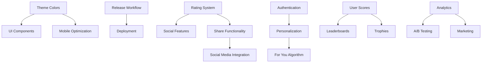

# Multi-Agent Execution Plan for vibechecc Platform

## Overview

This plan orchestrates multiple specialized AI agents working in parallel across different aspects of the vibechecc platform. Each agent has specific responsibilities, expertise areas, and coordination requirements.

## Agent Roster & Specializations

### 1. Infrastructure Architect Agent

**Specialization**: Backend systems, Convex functions, database schema, CI/CD
**Primary Plans**:

- `technical-fixes.md`
- Database aspects of all other plans

### 2. UI Architect Agent

**Specialization**: React components, TanStack Start, animations, responsive design
**Primary Plans**:

- `ui-ux-improvements.md`
- `style-guide-enforcement.md` (frontend portions)

### 3. Quality Assurance Validator Agent

**Specialization**: Testing, validation, performance monitoring
**Primary Plans**:

- Testing sections of all plans
- Cross-feature integration testing

### 4. Security Auditor Agent

**Specialization**: Authentication, authorization, data protection
**Primary Plans**:

- `auth-onboarding-improvements.md`
- Security aspects of all features

### 5. DevOps Monorepo Manager Agent

**Specialization**: Nx workspace, build optimization, deployment
**Primary Plans**:

- `technical-fixes.md` (release workflow)
- `style-guide-enforcement.md` (monorepo structure)

### 6. SEO Analytics Expert Agent

**Specialization**: Tracking, analytics, A/B testing, conversion optimization
**Primary Plans**:

- Analytics portions of `auth-onboarding-improvements.md`
- `discovery-recommendations.md` (metrics)
- `marketing-strategy.md`

### 7. Mobile App Developer Agent

**Specialization**: Mobile-first design, touch interactions, viewport optimization
**Primary Plans**:

- Mobile portions of `ui-ux-improvements.md`
- Mobile testing across all features

## Execution Phases

### Phase 1: Foundation Sprint (Days 1-21)

**Duration**: 3 weeks
**Parallel Workstreams**: 3

#### Workstream A: Critical Infrastructure (Days 1-5)

**Lead Agent**: DevOps Monorepo Manager
**Support Agent**: Infrastructure Architect

**Tasks**:

```yaml
- task: Fix release notes generation
  plan: technical-fixes.md
  priority: P0
  duration: 2-3 days
  dependencies: none

- task: Setup deployment monitoring
  plan: technical-fixes.md
  priority: P0
  duration: 1-2 days
  dependencies: none
```

#### Workstream B: Code Standards (Days 1-14)

**Lead Agent**: UI Architect
**Support Agent**: Quality Assurance Validator

**Tasks**:

```yaml
- task: Theme color standardization
  plan: style-guide-enforcement.md
  priority: P0
  duration: 2-3 days
  dependencies: none
  files:
    - apps/web/src/styles/
    - apps/web/src/components/

- task: File naming conventions
  plan: style-guide-enforcement.md
  priority: P0
  duration: 1-2 days
  dependencies: none

- task: Component reorganization
  plan: style-guide-enforcement.md
  priority: P1
  duration: 3-5 days
  dependencies: [file_naming]
```

#### Workstream C: Quick UI Fixes (Days 3-7)

**Lead Agent**: Mobile App Developer
**Support Agent**: UI Architect

**Tasks**:

```yaml
- task: Fix follow button styling
  plan: technical-fixes.md
  priority: P0
  duration: 0.5-1 day
  dependencies: [theme_colors]

- task: Fix animation performance
  plan: ui-ux-improvements.md
  priority: P1
  duration: 1 hour
  dependencies: none

- task: Fix profile review card gaps
  plan: ui-ux-improvements.md
  priority: P2
  duration: 2-3 hours
  dependencies: [theme_colors]
```

### Coordination Checkpoint 1 (Day 7)

```yaml
checkpoint:
  name: Foundation Review
  participants: [all_agents]
  objectives:
    - Verify theme standardization complete
    - Confirm release workflow functional
    - Review mobile quick fixes
  deliverables:
    - Status report
    - Dependency updates
    - Risk assessment
```

### Phase 2: Core Features Sprint (Days 8-35)

**Duration**: 4 weeks
**Parallel Workstreams**: 4

#### Workstream A: Rating System Overhaul (Days 8-21)

**Lead Agent**: Infrastructure Architect
**Support Agents**: UI Architect, Security Auditor

**Tasks**:

```yaml
- task: Fix revolving emoji bug
  plan: rating-review-improvements.md
  priority: P0
  duration: 1-2 days
  dependencies: none
  agents:
    - infrastructure_architect: backend logic
    - ui_architect: frontend display

- task: Implement one review per emoji
  plan: rating-review-improvements.md
  priority: P1
  duration: 1-2 days
  dependencies: none
  agents:
    - infrastructure_architect: validation logic
    - security_auditor: permission checks

- task: Prevent self-rating
  plan: rating-review-improvements.md
  priority: P1
  duration: 1 day
  dependencies: none

- task: Rating share functionality
  plan: rating-review-improvements.md
  priority: P1
  duration: 2-3 days
  dependencies: [emoji_bug_fix]
  agents:
    - ui_architect: canvas generation
    - mobile_app_developer: mobile share APIs

- task: Rating like system
  plan: rating-review-improvements.md
  priority: P2
  duration: 2-3 days
  dependencies: [one_review_per_emoji]
  agents:
    - infrastructure_architect: database schema
    - ui_architect: like button component
```

#### Workstream B: Mobile Optimization (Days 8-14)

**Lead Agent**: Mobile App Developer
**Support Agent**: UI Architect

**Tasks**:

```yaml
- task: Mobile feed card improvements
  plan: ui-ux-improvements.md
  priority: P1
  duration: 4-6 hours
  dependencies: [theme_colors]
  subtasks:
    - Viewport detection
    - Fade-in animations
    - 9:16 aspect ratios
    - Text overlays

- task: Social media snippet optimization
  plan: ui-ux-improvements.md
  priority: P1
  duration: 6-8 hours
  dependencies: none
  subtasks:
    - Square format cards
    - Toggle content sections
    - Inline metadata
```

#### Workstream C: Authentication Improvements (Days 15-28)

**Lead Agent**: Security Auditor
**Support Agents**: SEO Analytics Expert, UI Architect

**Tasks**:

```yaml
- task: Apple ID only authentication
  plan: auth-onboarding-improvements.md
  priority: P1
  duration: 2-3 days
  dependencies: none
  agents:
    - security_auditor: auth logic
    - ui_architect: signin UI updates

- task: Signup CTAs for unauthenticated
  plan: auth-onboarding-improvements.md
  priority: P1
  duration: 3-4 days
  dependencies: [apple_id_auth]

- task: Private mode token carryover
  plan: auth-onboarding-improvements.md
  priority: P2
  duration: 3-4 days
  dependencies: [apple_id_auth]
```

#### Workstream D: Analytics Setup (Days 8-21)

**Lead Agent**: SEO Analytics Expert
**Support Agent**: Infrastructure Architect

**Tasks**:

```yaml
- task: Welcome tagline A/B testing
  plan: auth-onboarding-improvements.md
  priority: P2
  duration: 2-3 days
  dependencies: none

- task: Placeholder performance tracking
  plan: auth-onboarding-improvements.md
  priority: P2
  duration: 2-3 days
  dependencies: none

- task: Engagement metrics setup
  plan: discovery-recommendations.md
  priority: P2
  duration: 3-4 days
  dependencies: none
```

### Coordination Checkpoint 2 (Day 21)

```yaml
checkpoint:
  name: Core Features Review
  participants: [all_agents]
  objectives:
    - Rating system fully functional
    - Mobile experience optimized
    - Authentication flow improved
  deliverables:
    - Integration test results
    - Performance metrics
    - User feedback analysis
  decisions:
    - Proceed to advanced features?
    - Any blocking issues?
    - Resource reallocation needed?
```

### Phase 3: Advanced Features Sprint (Days 36-70)

**Duration**: 5 weeks
**Parallel Workstreams**: 3

#### Workstream A: Discovery & Recommendations (Days 36-56)

**Lead Agent**: Infrastructure Architect
**Support Agents**: SEO Analytics Expert, UI Architect

**Tasks**:

```yaml
- task: Discover page rework
  plan: discovery-recommendations.md
  priority: P2
  duration: 1 week
  dependencies: [rating_system_complete]
  subtasks:
    - Feature flag for collections
    - Fix trending algorithm
    - UI improvements

- task: For You algorithm
  plan: discovery-recommendations.md
  priority: P2
  duration: 2 weeks
  dependencies: [discover_rework]
  subtasks:
    - Interest tag matching
    - Interaction history analysis
    - Emoji preference tracking

- task: Recommendation testing
  plan: discovery-recommendations.md
  priority: P2
  duration: 1 week
  dependencies: [for_you_algorithm]
```

#### Workstream B: Social Features (Days 36-63)

**Lead Agent**: UI Architect
**Support Agents**: Infrastructure Architect, Mobile App Developer

**Tasks**:

```yaml
- task: Social media integration
  plan: social-community-features.md
  priority: P3
  duration: 1 week
  dependencies: [share_functionality]
  platforms:
    - Discord
    - Twitter/X
    - Instagram
    - TikTok

- task: Leaderboards system
  plan: social-community-features.md
  priority: P3
  duration: 1.5 weeks
  dependencies: [user_score_system]

- task: Trophy achievements
  plan: social-community-features.md
  priority: P3
  duration: 1.5 weeks
  dependencies: [user_score_system]
  trophies:
    - vibe slut (>4.5 ratings)
    - vibe snob (<3 ratings)
    - vibe connoisseur (diverse emojis)
    - baby viber (new user)
    - vibesetter (early adopter)
    - stealth viber (no follows)
```

#### Workstream C: Quality & Performance (Days 36-49)

**Lead Agent**: Quality Assurance Validator
**Support Agents**: All agents

**Tasks**:

```yaml
- task: Integration testing
  priority: P1
  duration: 1 week
  dependencies: [all_phase2_features]

- task: Performance optimization
  priority: P1
  duration: 1 week
  dependencies: [integration_testing]

- task: Security audit
  priority: P1
  duration: 3 days
  dependencies: [integration_testing]
```

### Coordination Checkpoint 3 (Day 56)

```yaml
checkpoint:
  name: Advanced Features Review
  participants: [all_agents]
  objectives:
    - Discovery/recommendations functional
    - Social features integrated
    - Platform stability verified
  deliverables:
    - Feature completion report
    - Performance benchmarks
    - Security audit results
  decisions:
    - Ready for marketing push?
    - Feature flag configurations
    - Launch timeline
```

### Phase 4: Launch Preparation (Days 71-84)

**Duration**: 2 weeks
**Parallel Workstreams**: 2

#### Workstream A: Final Polish

**Lead Agents**: UI Architect, Mobile App Developer
**Tasks**:

```yaml
- task: UI consistency pass
  duration: 3 days

- task: Mobile experience validation
  duration: 2 days

- task: Accessibility improvements
  duration: 2 days
```

#### Workstream B: Marketing Readiness

**Lead Agent**: SEO Analytics Expert
**Tasks**:

```yaml
- task: Analytics verification
  duration: 2 days

- task: Conversion funnel optimization
  duration: 3 days

- task: A/B test configuration
  duration: 2 days
```

## Agent Communication Protocol

### Daily Standups

```yaml
schedule: Daily at 9 AM
format: Async status updates
content:
  - Completed tasks (last 24h)
  - Current tasks (next 24h)
  - Blockers/dependencies
  - Integration points
```

### Weekly Sync

```yaml
schedule: Weekly on Mondays
format: Synchronous review
content:
  - Sprint progress
  - Dependency resolution
  - Risk mitigation
  - Resource allocation
```

### Emergency Protocol

```yaml
triggers:
  - Critical bug discovered
  - Security vulnerability
  - Production incident
  - Major dependency conflict

response:
  - Immediate notification to all agents
  - Lead agent assignment
  - 1-hour resolution target
  - Post-mortem required
```

## Dependency Matrix



## Success Metrics

### Phase 1 Success Criteria

- [ ] Zero hardcoded colors in codebase
- [ ] Release workflow generates correct notes
- [ ] All files follow naming conventions
- [ ] Mobile animations < 16ms frame time

### Phase 2 Success Criteria

- [ ] Rating system bug-free
- [ ] Share functionality viral coefficient > 0.1
- [ ] Apple ID auth conversion > 60%
- [ ] Mobile engagement +25%

### Phase 3 Success Criteria

- [ ] For You CTR > 15%
- [ ] Social features DAU +30%
- [ ] Trophy engagement > 40% users
- [ ] Discovery page bounce rate < 30%

### Phase 4 Success Criteria

- [ ] Platform stability 99.9%
- [ ] Conversion funnel optimized
- [ ] All features feature-flagged
- [ ] Marketing channels verified

## Risk Mitigation

### Technical Risks

```yaml
risk: Database migration failures
mitigation:
  - Staged rollout
  - Rollback procedures
  - Data backups

risk: Performance degradation
mitigation:
  - Load testing
  - Performance budgets
  - Monitoring alerts

risk: Integration conflicts
mitigation:
  - Feature flags
  - Canary deployments
  - A/B testing
```

### Coordination Risks

```yaml
risk: Agent communication breakdown
mitigation:
  - Daily standups
  - Shared context documents
  - Clear ownership boundaries

risk: Dependency bottlenecks
mitigation:
  - Parallel workstreams
  - Buffer time in estimates
  - Resource reallocation protocol
```

## Resource Allocation

### Agent Availability Matrix

```yaml
phase_1:
  infrastructure_architect: 60%
  ui_architect: 80%
  quality_assurance: 40%
  security_auditor: 20%
  devops_manager: 100%
  seo_analytics: 20%
  mobile_developer: 60%

phase_2:
  infrastructure_architect: 80%
  ui_architect: 100%
  quality_assurance: 60%
  security_auditor: 80%
  devops_manager: 40%
  seo_analytics: 60%
  mobile_developer: 100%

phase_3:
  infrastructure_architect: 100%
  ui_architect: 80%
  quality_assurance: 80%
  security_auditor: 40%
  devops_manager: 20%
  seo_analytics: 80%
  mobile_developer: 60%

phase_4:
  all_agents: 60%
```

## Execution Commands

### Initialize Phase 1

```bash
# Start all Phase 1 workstreams
claude-code --agent devops-monorepo-manager --task "Execute Phase 1 Workstream A from multi-agent-execution-plan.md"
claude-code --agent ui-architect --task "Execute Phase 1 Workstream B from multi-agent-execution-plan.md"
claude-code --agent mobile-app-developer --task "Execute Phase 1 Workstream C from multi-agent-execution-plan.md"
```

### Monitor Progress

```bash
# Check agent status
claude-code --status all-agents
claude-code --dependencies check
claude-code --metrics phase1
```

### Checkpoint Review

```bash
# Run checkpoint validation
claude-code --checkpoint 1 --validate
claude-code --report phase1-completion
```

## Continuous Improvement

### Learning Capture

- Each agent documents learnings in `.agent/docs/[agent-name]-learnings.md`
- Weekly learning synthesis into `.agent/docs/weekly-synthesis.md`
- Post-phase retrospectives in `.agent/docs/phase-[n]-retro.md`

### Plan Updates

- Daily plan adjustments based on progress
- Weekly timeline recalibration
- Phase-end comprehensive review

### Knowledge Transfer

- Agent handoffs include context documents
- Shared learnings repository
- Cross-training on overlapping areas

---

## Quick Start Guide

### For Project Manager

1. Review this plan and approve phase sequencing
2. Assign human oversight for each workstream
3. Set up monitoring dashboards
4. Schedule checkpoint reviews

### For Individual Agents

1. Locate your assigned tasks in relevant phase
2. Check dependencies before starting
3. Update progress daily
4. Document blockers immediately
5. Participate in coordination checkpoints

### For DevOps

1. Set up CI/CD for each workstream
2. Configure feature flags
3. Implement monitoring
4. Prepare rollback procedures

---

**Total Timeline**: 12 weeks (84 days)
**Total Agent Hours**: ~2,000 hours
**Parallel Workstreams**: Up to 4 concurrent
**Coordination Overhead**: 15% of total time
**Buffer Time**: 20% included in estimates

This multi-agent plan enables efficient parallel execution while maintaining coordination and quality standards across the entire vibechecc platform development.
